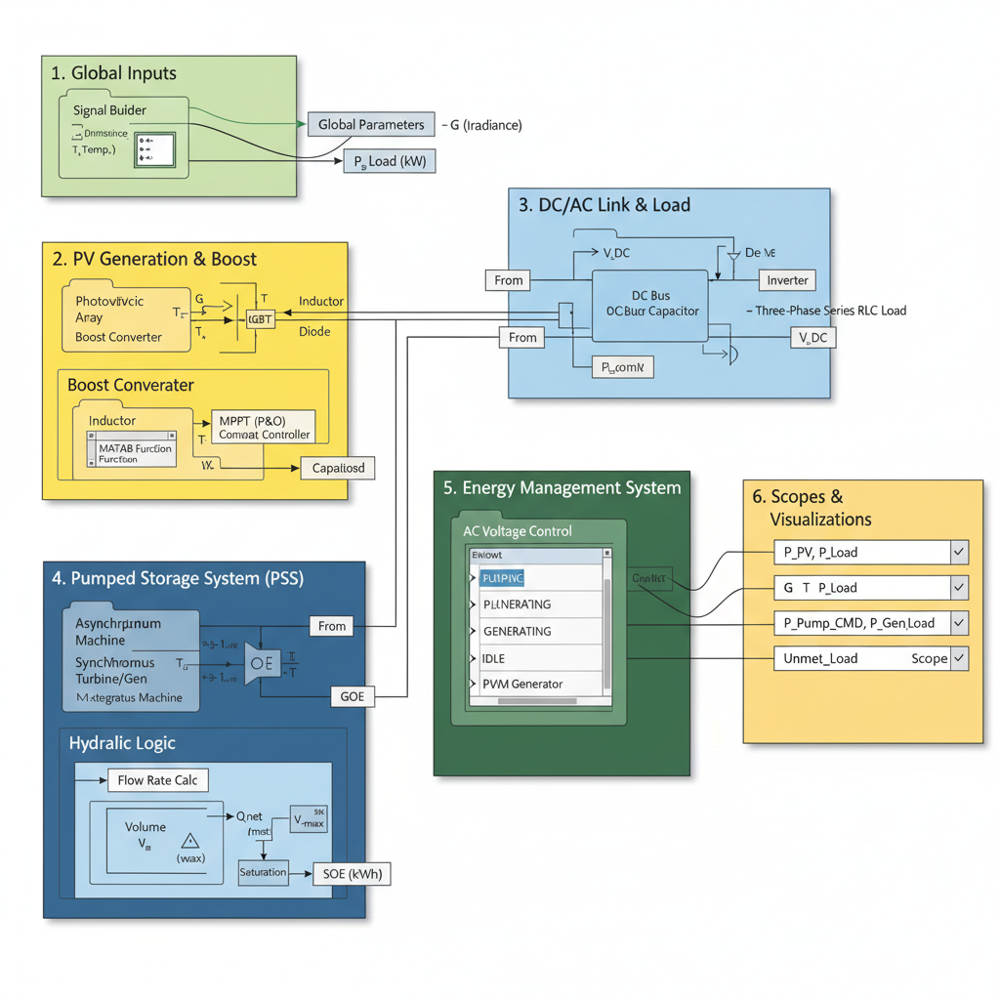

# ⚡ PV Pumped Storage Hybrid Energy System

A 10 kW hybrid renewable energy system integrating photovoltaic (PV) generation with pumped hydro energy storage, designed and simulated using MATLAB Simulink.

---

## 🔍 Project Overview

This project demonstrates an advanced hybrid energy system where solar power is combined with pumped storage to ensure continuous and reliable power supply. The system intelligently switches between energy generation and storage modes depending on solar availability.

---

## ⚙️ Key Features

* ☀️ 10 kW PV Array with MPPT (Perturb & Observe Algorithm)
* 🔄 DC-DC Boost Converter for voltage regulation
* 🔌 DC Bus for system integration
* ⚡ Three-phase inverter for AC load supply
* 💧 Pumped Storage System (Pump + Turbine)
* 🧠 BIS Controller for smart energy management

---

## 🧠 System Architecture

PV Array → Boost Converter → DC Bus → Inverter → AC Load
↕
Pumped Storage System

---

## 📷 Model Diagram

---

## 🛠️ Tools & Technologies

* MATLAB Simulink
* Simscape Electrical
* Control Systems

---

## 📊 Results

* Continuous power supply under varying solar irradiance
* Efficient switching between pumping and generating modes
* Stable DC Bus voltage throughout operation
* Approximate system efficiency of ~70%

---

## 💡 Key Concepts

* Renewable Energy Integration
* Energy Storage Systems
* Power Electronics
* Control Systems

---

## 📈 Observations

* PV output varies with irradiance and temperature
* MPPT ensures maximum power extraction
* Pump operates during excess solar generation
* Turbine supplies power during low irradiance
* BIS controller maintains system stability

---

## 🚀 Future Scope

* Hardware implementation using real components
* AI-based control strategies for optimization
* Integration with smart grid systems

---

## 👨‍💻 Author

Vishal
B.Tech Electrical Engineering
Nataji Subhas University of Technology, Dwarka

---

